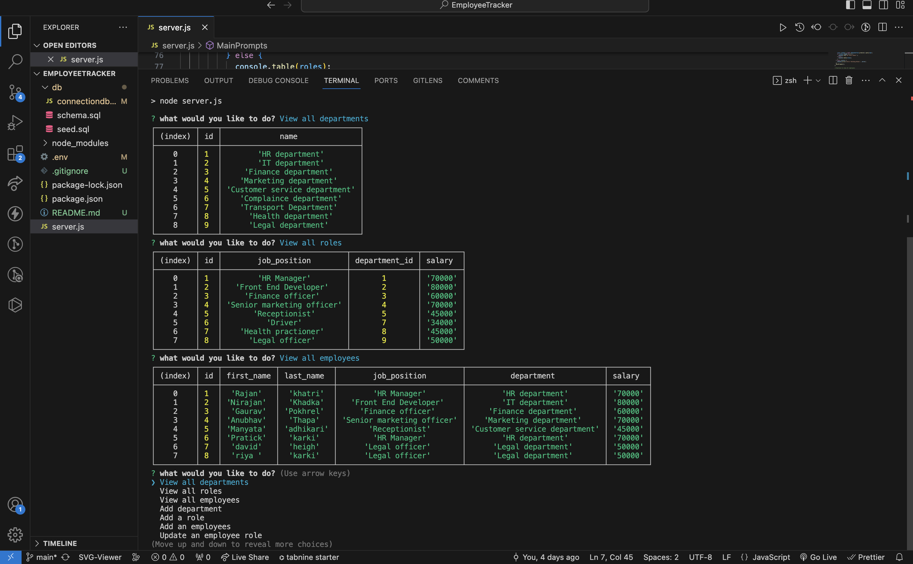
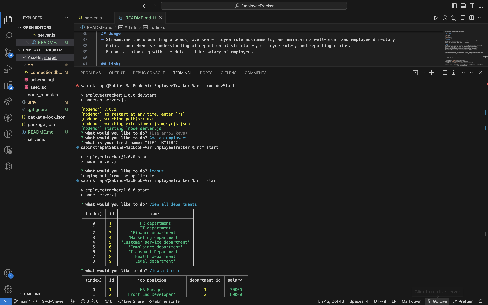

 
  # Title
 WORKFORCE-EXPLORER
  
  ## Description
   This application serves as a simple yet remarkably potent solution for employee management, enabling companies to have insights into their workforce and access specific employee information.

  
  ## Table of Contents
  
  - [Installation](#Installation)
  - [Usage](#usage)
  - [Features](#features)
  - [Links](#links)
  - [credits](#credits)
  - [License](#license)
  
  ## Installation
  To ensure the application runs successfully in your local machine, you need to follow following guidelines:
  - Clone the repository to your local machine
  - Install NodeJS- 'npm install' and package inquirer- npm i inquirer@8.2.4
  - Set up your schema file with the database 
  - Execute the application

  ## Notes

  - Populating database command line: ('mysql -u root -p') 
  - make sure the dependencies for mysql in package.json as  "mysql2:----".
  - .env files are a popular method for managing application configuration outside of the application code, often containing sensitive data such as API keys, database credentials, and other configuration settings. The sample configuration setting of env file:
    DB_HOST=localhostname
    DB_USER=root_name
    DB_PASSWORD=Your_password
    DB_DATABASE=Your_databaseName

  ## Features

  - Comprehensive Data View: Easily access all department, role, and employee information in one simple command.
  - Effortless Data Addition: Add new departments, roles, and employees seamlessly to the database.
  - Flexible Role Management: Assign employees to roles dynamically and create new roles as needed.
  - Hierarchical Organization: Establish managerial relationships by assigning managers to employees.
  - Role Updates: Adapt to organizational changes by modifying an employee's role when necessary.
  - User-Friendly Interface: Intuitive prompts guide users through each operation, ensuring a user-friendly experience.
  - Data Consistency: Embedded constraints guarantee the consistency and reliability of your data.

  ## Usage
  - Streamline the onboarding process, oversee employee role assignments, and maintain a well-organized employee directory.
  - Gain a comprehensive understanding of departmental structures, employee roles, and reporting chains.
  - Financial planning with the details like salary of employees

  ## links
  - Link of my [Github repository](https://github.com/Sabinkthapa/WorkForce-Explorer.git)
  - Link to screencastify [Application_walkthrough] (https://drive.google.com/file/d/19P1VxoSLvFE5GDl0EVLu79cEwWpI6xv_/view)
  - working app image-1 
  - working app image-2 
  

  ## Credits
  - link of mysql:Relational Database [mysql] (https://www.mysql.com/)
  - Link of Dependency [nodemon](https://www.npmjs.com/package/nodemon)
  - link of Dependency [inquirer] (https://www.npmjs.com/package/inquirer)

  ## License
   All resources provided by this project are available for free use and distribution,subject to the term of Apache license.
                                      (c)Copyright 2023 Sabin Thapa